## Contents

1. [Part1. Ready-made docker](#part1-ready-made-docker)  
2. [Part2. Operations with container](#part2-operations-with-container) 
3. [Part3. Mini web server](#part3-mini-web-server) 
4. [Part4. Your own docker](#part4-your-own-docker) 
5. [Part5. Dockle](#part5-dockle) 
6. [Part6. Basic Docker Compose](#part6-basic-docker-compose)

## Part1. Ready-made docker 

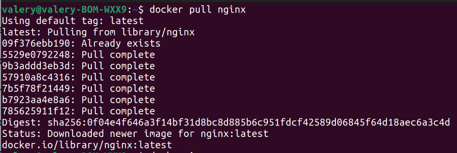

Скачал с Dockerhub готовый образ

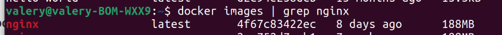

Проверил в images

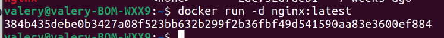

Запустил контейнер с этим образом

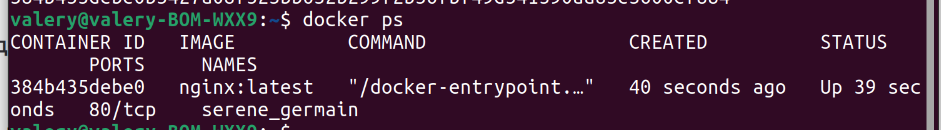

Посмотрел запущенные контейнеры

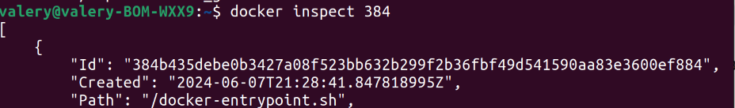

Посмотрел информацию о контейнере

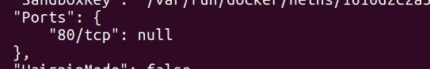

Посмотрел на каких портах запущен контейнер

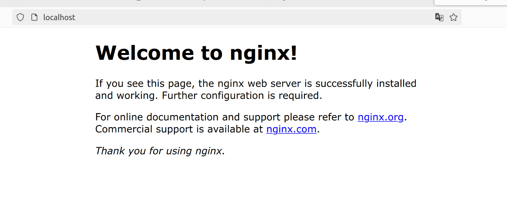

Проверил что nginx работает

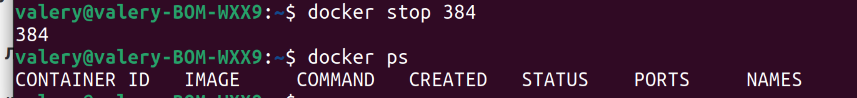

Остановил контейнер

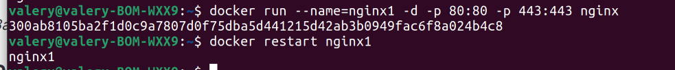

Запустил контейнер с мостом для сетей через порты

## Part2. Operations with container

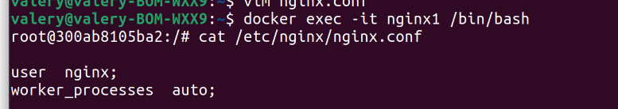

Использование оболочки bash в контейнере и cat 

Копирование конфига на "локально" 

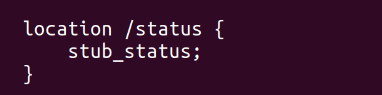

Добавление ручки state

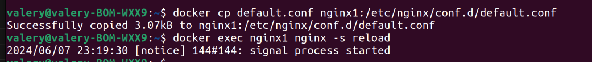

Копирование конфига и перегрузка ngingx

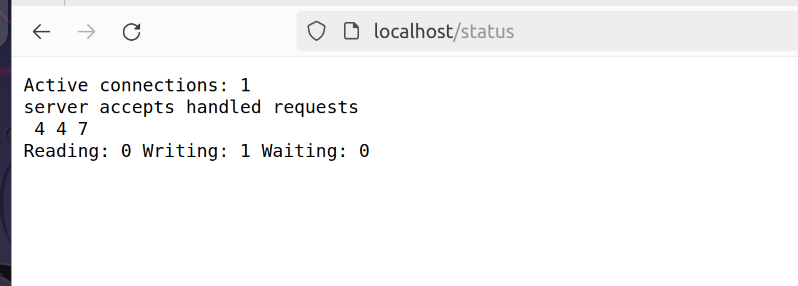

Проверка ручки

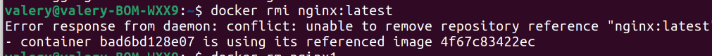

Удаление image

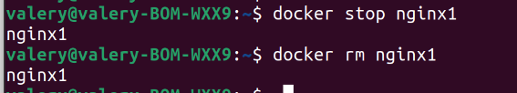

Остановка и удаление контейнера

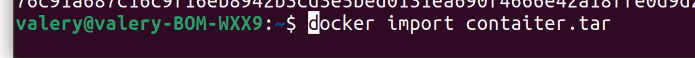

Import image

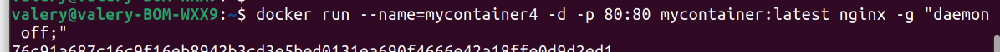

Запуск импортированного имеджа

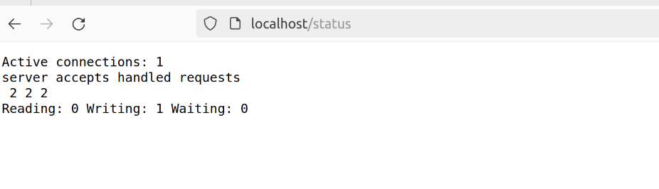

Провкра

## Part3. Mini web server

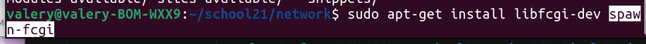

Установка необходимых библеотек

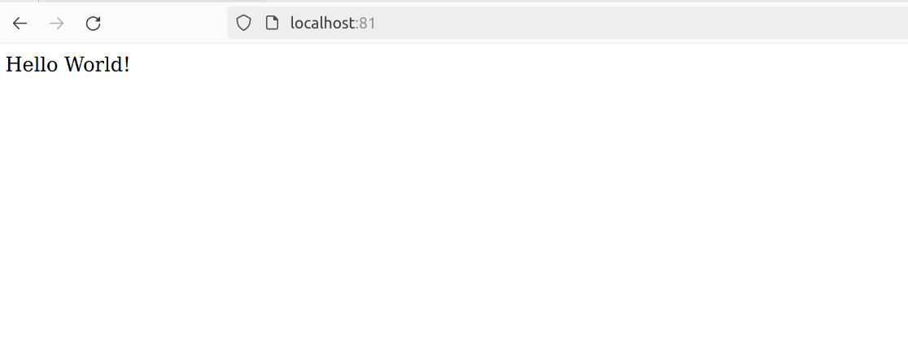

Запуск на 81 порту

## Part4. Your own docker

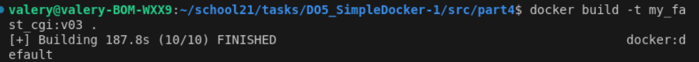

Билд своего image

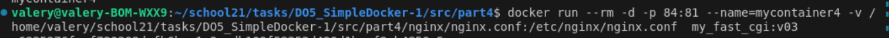

Мапинг папки и портов

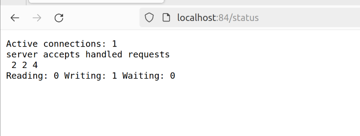 

Проверка сервиса

## Part5. Dockle

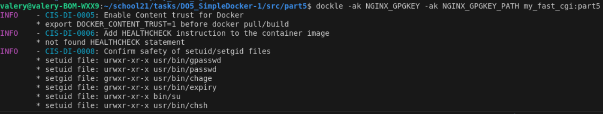

Проверка dockle

## Part6. Basic Docker Compose

